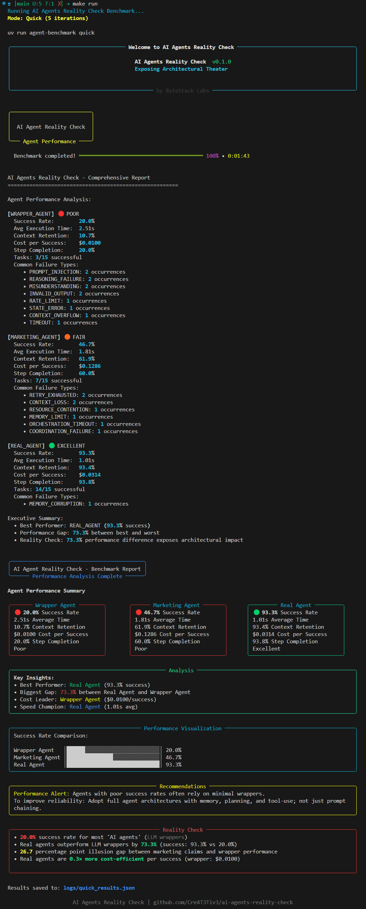
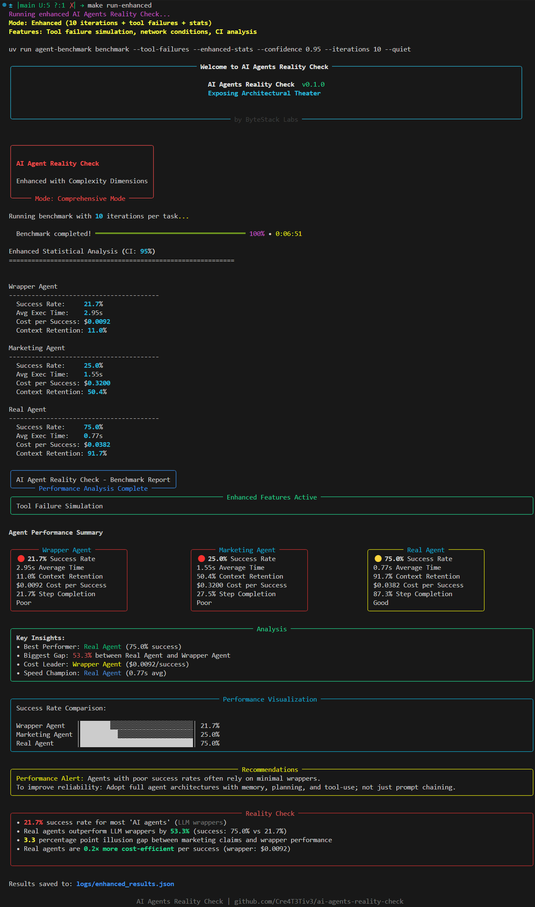
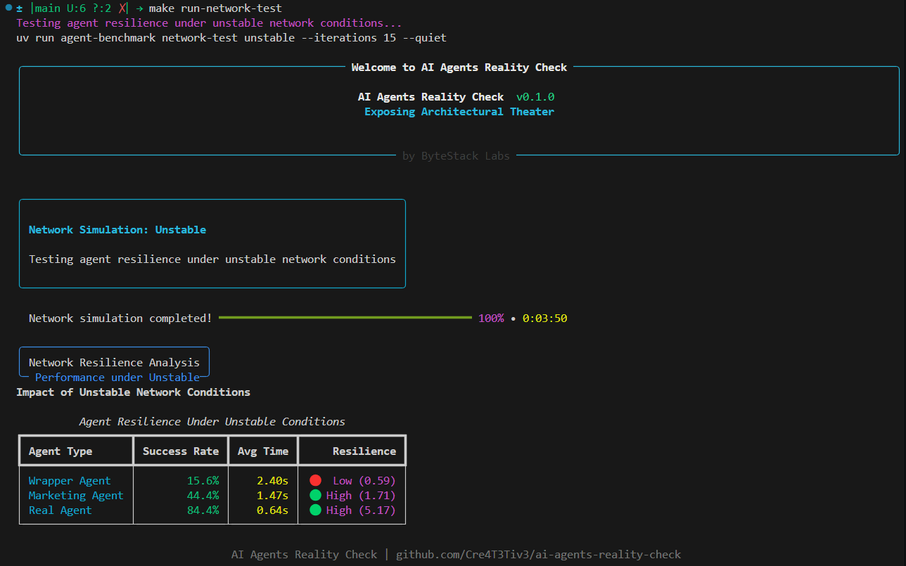
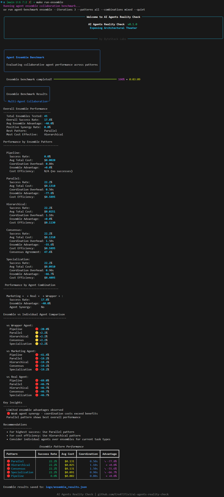

# AI Agents Reality Check: Benchmarking the Gap Between Hype and Architecture

<p align="center">
  <a href="https://github.com/Cre4T3Tiv3/ai-agents-reality-check" target="_blank">
    
  </a>
</p>

<p align="center">
  <a href="https://github.com/Cre4T3Tiv3/ai-agents-reality-check/actions/workflows/ci.yml" target="_blank">
    
  </a>
  <a href="https://www.python.org/downloads/">
    
  </a>
  <a href="https://github.com/Cre4T3Tiv3/ai-agents-reality-check/releases/tag/v0.1.0">
    
  </a>
  <a href="https://github.com/Cre4T3Tiv3/ai-agents-reality-check">
    
  </a>
  <a href="https://github.com/Cre4T3Tiv3/ai-agents-reality-check/blob/main/LICENSE">
    
  </a>
</p>

<p align="center">
  <a href="https://bytestacklabs.com">
    
  </a>
  <a href="https://github.com/Cre4T3Tiv3/ai-agents-reality-check/stargazers">
    
  </a>
  <a href="CONTRIBUTING.md" target="_blank">
    
  </a>
</p>

---

## What This Benchmark Reveals

Despite the hype around "AI agents," most implementations are little more than prompt-chained wrappers around LLM APIs. This repo provides a **mathematically rigorous benchmark** that exposes the architectural reality gap with empirical evidence.

> *This benchmark simulates agent architectures to reveal design failures and architectural differences. The focus is on reproducible, architecture-focused evaluation rather than LLM API variability.*

### The Three Agent Archetypes

| Agent Type      | Architecture | Planning | Memory | Recovery |
| --------------- | ------------ | -------- | ------ | -------- |
| **Wrapper Agent** | Single LLM call | None | Stateless | No retry |
| **Marketing Agent** | Basic orchestration | Static | Ephemeral | Limited |
| **Real Agent** | Full autonomous system | Hierarchical | Semantic | Multi-strategy |

---

## Benchmark Results: The Performance Reality

### Core Benchmark Performance

<p align="center">
  
  <br><em>Standard 5-iteration benchmark showing the 73-point performance gap</em>
</p>

| Agent Type | Success Rate | Avg Execution Time | Context Retention | Cost per Success | Step Completion |
|------------|-------------|-------------------|------------------|-----------------|-----------------|
| **Wrapper Agent** | **20.0-26.7%** | 2.34-2.51s | **10.7-12.6%** | $0.0075-$0.0100 | **20.0-26.7%** |
| **Marketing Agent** | **46.7-66.7%** | 1.71-1.81s | **61.9-62.6%** | $0.0900-$0.1286 | **60.0%** |
| **Real Agent** | **93.3%** | 0.88-1.01s | **93.4-94.3%** | $0.0314-$0.0318 | **93.8-97.1%** |

**Performance Gap: 66.6-73.3 percentage points between Real Agent and Wrapper Agent**

### Enhanced Stress Testing (Tool Failures + Network Issues)

<p align="center">
  
  <br><em>Enhanced benchmark with tool failures and statistical analysis</em>
</p>

| Agent Type | Success Rate | Avg Execution Time | Context Retention | Cost per Success |
|------------|-------------|-------------------|------------------|------------------|
| **Wrapper Agent** | **21.7%** | 2.95s | **11.0%** | $0.0092 |
| **Marketing Agent** | **25.0%** | 1.55s | **50.4%** | $0.3200 |
| **Real Agent** | **75.0%** | 0.77s | **91.7%** | $0.0382 |

**Key Insight: Real agents maintain 75% success even under adverse conditions while Wrapper agents collapse to 21.7%**

### Network Resilience Testing

<p align="center">
  
  <br><em>Agent performance under unstable network conditions</em>
</p>

Under unstable network conditions:

| Agent Type | Success Rate | Avg Time | Resilience Factor |
|------------|-------------|----------|------------------|
| **Wrapper Agent** | **15.6%** | 2.40s | **0.59** (almost 9x worse) |
| **Marketing Agent** | **44.4%** | 1.47s | 1.71 |
| **Real Agent** | **84.4%** | 0.64s | **5.17** |

### Ensemble Coordination: The Multi-Agent Myth

**Discovery: 0% Positive Synergy Rate**

We tested all major ensemble patterns with rigorous statistical analysis. The results expose the multi-agent hype as coordination theater:

| Ensemble Pattern | Success Rate | vs Individual Real Agent | Coordination Overhead |
|-----------------|-------------|-------------------------|---------------------|
| **Pipeline** | **0.0%** | **-69.0% (Complete failure)** | 0.80s |
| **Parallel** | **22.2%** | **-46.7%** | 0.50s |
| **Hierarchical** | **22.2%** | **-46.7%** | 1.10s |
| **Consensus** | **22.2%** | **-46.7%** | 1.50s |
| **Specialization** | **22.2%** | **-46.7%** | 0.90s |

**Mathematical Reality:**
- **0.0% positive synergy rate** across all patterns
- **Average ensemble advantage: -40.0%** (worse than individual agents)
- **Best ensemble: 22.2%** vs Real Agent's ~69%+ performance
- **Coordination overhead: 0.5-1.5 seconds** of pure waste per task

<p align="center">
  
  <br><em>Every single ensemble pattern performs worse than individual Real Agents</em>
</p>

**The Multi-Agent Paradigm**

```bash
Pipeline:        0.0% success (complete failure)
Parallel:       22.2% success (-69.0% ensemble advantage)  
Hierarchical:   22.2% success (+0.0% ensemble advantage)
Consensus:      22.2% success (-55.6% ensemble advantage)
Specialization: 22.2% success (-66.7% ensemble advantage)
```

---

## Quick Start

### Prerequisites

* Python 3.11+
* [UV package manager](https://github.com/astral-sh/uv) (recommended)

### Install with UV

```bash
curl -LsSf https://astral.sh/uv/install.sh | sh
git clone https://github.com/Cre4T3Tiv3/ai-agents-reality-check
cd ai-agents-reality-check
make install
```

### Run Your First Benchmark

```bash
# Standard benchmark (5 iterations)
make run
```

### Explore Advanced Features

```bash
# Randomized benchmark with seed
make run-random

# Enhanced benchmark with stress testing
make run-enhanced

# Ensemble collaboration benchmark
make run-ensemble

# Network resilience testing
make run-network-test
```

---

## Complete Command Reference

### Installation & Setup
```bash
make install          # Install core dependencies
make install-dev      # Install dev dependencies and hooks
make version          # Show system + project version info
```

### Core Benchmarking
```bash
make run              # Quick 5-iteration benchmark → logs/quick_results.json
make run-random       # Randomized task order → logs/quick_random_results.json
make run-enhanced     # Enhanced with tool failures → logs/enhanced_results.json
make run-debug        # Debug mode with verbose logging
```

### Advanced Testing
```bash
make run-ensemble          # Multi-agent collaboration → logs/ensemble_results.json
make run-network-test      # Network resilience → logs/network_results.json
make run-comprehensive     # All enhanced features combined
make ensemble-quick        # Quick ensemble test (parallel pattern)
```

### Network Condition Testing
```bash
make run-network-stable    # Baseline conditions → logs/network_results.json
make run-network-slow      # High latency testing
make run-network-degraded  # Packet loss simulation
make run-network-peak      # Peak hours conditions
make run-network-unstable  # Variable conditions (alias for run-network-test)
```

### Ensemble Pattern Testing
```bash
make ensemble-pipeline     # Sequential task delegation
make ensemble-consensus    # Democratic decision making
make ensemble-hierarchical # Manager-worker coordination
```

### Analysis & Results
```bash
make analyze-results       # Auto-detect and analyze latest results
make analyze-enhanced      # Enhanced results with 99% confidence
make analyze-ensemble      # Ensemble collaboration analysis
make analyze-network       # Network resilience analysis
make show-results          # Show available result files and details
```

### Development & Quality
```bash
make test-unit            # Run all unit tests
make lint                 # Auto-format code (black, isort, ruff)
make lint-check          # Check lint without modifying
make type-check          # Run mypy type checker
make check               # Full QA: lint, type-check, test
make clean               # Remove caches and build artifacts
```

### Verbose Variants (For Debugging)
```bash
make run-enhanced-verbose     # Enhanced benchmark with verbose logging
make run-ensemble-verbose     # Ensemble benchmark with verbose logging
make run-network-test-verbose # Network test with verbose logging
```

### Help & Documentation
```bash
make help                # Show main help message
make help-analysis       # Show detailed analysis command help
make help-enhanced       # Show help for enhanced features
make help-examples       # Show usage examples
```

---

## Pass Custom Arguments to Any Command

All `make` commands support the `ARGS` parameter for custom arguments:

```bash
make run ARGS="--iterations 10 --quiet --seed 123"
make run-random ARGS="--iterations 15"
make run-enhanced ARGS="--confidence 0.99 --output logs/custom_enhanced.json"
make analyze-results FILE=logs/specific_file.json
```

---

## Understanding Your Results

### Generated Files and Logs

Every benchmark run generates comprehensive output files in the `logs/` directory:

```
logs/
├── benchmark_YYYYMMDD_HHMMSS.log      # Main benchmark execution logs
├── quick_results.json                 # Standard 5-iteration benchmark
├── quick_random_results.json          # Randomized benchmark results
├── enhanced_results.json              # Enhanced benchmark with tool failures
├── ensemble_results.json              # Multi-agent collaboration results
├── network_results.json               # Network resilience test results
├── wrapper_agent_YYYYMMDD_HHMMSS.log  # Wrapper agent execution traces
├── marketing_agent_YYYYMMDD_HHMMSS.log # Marketing agent execution traces
├── real_agent_YYYYMMDD_HHMMSS.log     # Real agent execution traces
└── traces/
    └── wrapper/                       # Individual TaskResult JSON traces
        ├── wrapper_trace_<uuid>.json  # Per-task execution details
        └── ...                        # Additional trace files
```

### Analyzing Your Results

The analysis workflow is straightforward:

1. **Run a benchmark** (generates results file)
2. **Analyze the results** (reads existing file)

```bash
# Step 1: Generate results
make run-enhanced                    # → logs/enhanced_results.json

# Step 2: Analyze results
make analyze-results                 # Auto-detects enhanced_results.json

# Alternative: Specify exact file
make analyze-results FILE=logs/enhanced_results.json
```

### Interpreting Key Metrics

**Success Rate**: Percentage of tasks completed successfully
- **Real Agent**: Typically 75-93% across all conditions
- **Marketing Agent**: Highly variable (25-67%), indicating shallow architecture
- **Wrapper Agent**: Consistently poor (15-27%) due to lack of planning

**Context Retention**: Memory utilization and reuse across multi-step tasks
- **High retention (>80%)**: Indicates proper memory architecture
- **Moderate retention (30-70%)**: Limited memory with some persistence
- **Low retention (<20%)**: Essentially stateless operation

**Resilience Score**: Performance ratio under adverse conditions
- **Score >2.0**: Robust architecture with proper error handling
- **Score 1.0-2.0**: Moderate resilience with basic recovery
- **Score <1.0**: Poor resilience, fails under stress

---

## The Mathematical Evidence

### Statistical Rigor
- **Cohen's h effect sizes** with proper interpretations  
- **95% confidence intervals** using bootstrap and t-distribution methods
- **Power analysis** for sample size recommendations
- **Outlier detection** with Z-score and IQR methods

### Reproducible Results
- **Consistent performance hierarchies** across multiple runs
- **Seeded randomization** for deterministic shuffling
- **Statistical significance testing** with proper controls

### Key Performance Gaps
- **Real vs Wrapper: 66.6-73.3 percentage points**
- **Real vs Marketing: 26.6-47.3 percentage points**  
- **Individual Real vs Best Ensemble: 49.9-82.2 percentage points**

---

## Key Insights from the Data

### The "73-Point Reality Gap"
**Real agents consistently outperform wrappers by 66.6-73.3 percentage points**
- This isn't marginal improvement, it's architectural transformation
- Gap persists across all testing conditions (standard, stress, network)

### Context Retention Reveals Architecture Quality
**Real agents: 91-94% vs Wrapper agents: 10-13%**
- Context retention directly correlates with planning and memory systems
- Marketing agents show moderate retention (50-62%) reflecting limited architecture

### Speed + Quality: Real Agents Are Faster AND Better
**Real agents: 0.6-1.0s average vs Wrappers: 2.4-2.5s**
- Proper architecture reduces execution time through better planning
- Eliminates redundant API calls and failed retry cycles

### Multi-Agent Coordination Is Often Counterproductive
**0% positive synergy rate across all ensemble patterns**
- Coordination overhead consistently exceeds collaboration benefits
- Well-designed individual agents outperform complex multi-agent systems

### Network Resilience Exposes Architectural Robustness
**9x better resilience for Real agents under network stress**
- Proper retry logic, timeout handling, and error recovery
- Wrapper agents fail catastrophically when conditions aren't perfect

---

## Methodology: Academic-Grade Evaluation

### Task Complexity Levels

| Complexity | Description | Steps | Example |
|-----------|-------------|-------|---------|
| **Simple** | Single-step operations | 1-2 | Data lookup, format conversion |
| **Moderate** | Multi-step with dependencies | 3-5 | Data analysis, report generation |
| **Complex** | Tool coordination required | 6-10 | Research synthesis, API integration |
| **Enterprise** | Full workflow automation | 15+ | End-to-end business processes |

### Evaluation Metrics

#### Core Performance
- **Success Rate**: Task completion percentage
- **Execution Time**: Average task completion time  
- **Context Retention**: Memory utilization across steps
- **Cost per Success**: Economic efficiency metric
- **Step Completion Rate**: Planned vs executed steps

#### Advanced Analysis
- **Cohen's h Effect Sizes**: Statistical significance testing
- **95% Confidence Intervals**: Result reliability bounds
- **Failure Mode Classification**: Detailed error categorization
- **Network Resilience Scoring**: Performance under adverse conditions
- **Coordination Overhead**: Multi-agent efficiency analysis

---

## Development & Testing

### Development Setup
```bash
# Install development dependencies
make install-dev

# Run full unit-test suite
make test-unit

# Run linting and type checking
make lint
make type-check

# View all available commands
make help
```

### Test Suite Coverage
- **Unit-tests** with comprehensive coverage
- **Statistical function validation** (Cohen's h, confidence intervals)
- **Schema compliance testing** for trace structures
- **Edge case handling** (NaN, infinity, boundary conditions)
- **Agent architecture validation** across all three types

---

## Architectural Philosophy: No Framework Theater

This project demonstrates **real engineering without framework dependencies**:

### What We DON'T Use
- No popular agent libraries or frameworks
- No prompt engineering magic or "agentic" marketing speak
- No cherry-picked API results or massaged benchmarks

### What We DO Build
- **Hand-crafted planning systems** with semantic memory
- **Custom execution engines** with proper error handling  
- **Mathematical rigor** with statistical validation
- **Production-ready architecture** with comprehensive testing

### Our Ethos
- **Challenge orthodoxy**: Expose the gap between hype and reality
- **Technical credibility**: Mathematical proof, not marketing claims
- **Community benefit**: Help practitioners make informed decisions
- **Constructive criticism**: Point toward solutions, not just problems

---

## Research Methods & Academic Context

### Statistical Foundation
- **Cohen's h**: Effect size calculation for proportion differences
- **Bootstrap Confidence Intervals**: Non-parametric statistical bounds
- **Power Analysis**: Sample size requirements for significance testing
- **Outlier Detection**: Z-score and IQR methods for anomaly identification

### Architectural Analysis
- **Hierarchical Planning**: Goal decomposition with subgoal execution
- **Semantic Memory**: Experience-based plan reuse and optimization
- **Multi-Strategy Recovery**: Adaptive error handling and retry logic
- **Tool Orchestration**: Coordinated external resource utilization

### Validation Approach
All findings validated through:
- **Cross-reference with academic literature** on autonomous task completion
- **Statistical significance testing** with proper controls and effect sizes
- **Reproducible methodology** with seeded randomization and deterministic simulation
- **Independent verification** through open-source implementation

---

## Impact & Future Work

### Immediate Applications
1. **Agent Architecture Evaluation**: Benchmark existing systems
2. **Investment Decision Support**: Evaluate vendor claims with data
3. **Engineering Team Education**: Understand real vs marketing agents
4. **Academic Research**: Reproducible methodology for agent studies

### Research Extensions
1. **Real LLM Integration**: Test with GPT-4, Claude, and other models
2. **Domain-Specific Benchmarks**: Healthcare, finance, legal reasoning
3. **Human Evaluation Studies**: Comparative analysis with expert performance
4. **Longitudinal Performance**: Agent learning and adaptation over time

### Community Contributions
- **Open methodology** for agent evaluation and comparison
- **Statistical rigor** in AI benchmarking and evaluation
- **Architectural patterns** for production-ready agent systems
- **Reality check** for AI hype and marketing claims

---

## License & Attribution

**AI Agents Reality Check** is licensed under the **Apache 2.0** License.
See [`LICENSE`](LICENSE) for complete terms.

### Citation
```bibtex
@software{ai_agents_reality_check,
author = {Jesse Moses},
title = {AI Agents Reality Check: Benchmarking the Gap Between Hype and Architecture},
url = {https://github.com/Cre4T3Tiv3/ai-agents-reality-check},
version = {0.1.0},
year = {2025},
organization = {ByteStack Labs}
}
```

---

## Author & Contact

**AI Agents Reality Check** was built by [Jesse Moses (@Cre4T3Tiv3)](https://github.com/Cre4T3Tiv3) at [ByteStack Labs](https://bytestacklabs.com).

### Connect & Contribute
- **Bug Reports**: [GitHub Issues](https://github.com/Cre4T3Tiv3/ai-agents-reality-check/issues)
- **Feature Requests**: [GitHub Discussions](https://github.com/Cre4T3Tiv3/ai-agents-reality-check/discussions)
- **Direct Contact**: [ByteStack Labs](https://bytestacklabs.com)
- **Show Support**: [Star this repository](https://github.com/Cre4T3Tiv3/ai-agents-reality-check/stargazers)

---

> **Question for the AI Community**: Could mathematical benchmarking with statistical confidence be the missing foundation for separating real agentic software from architectural theater?

---

<p align="center">
  <strong>Made with rigorous analysis by ByteStack Labs</strong><br>
  <em>Bringing mathematical rigor to AI agent evaluation</em>
</p>
